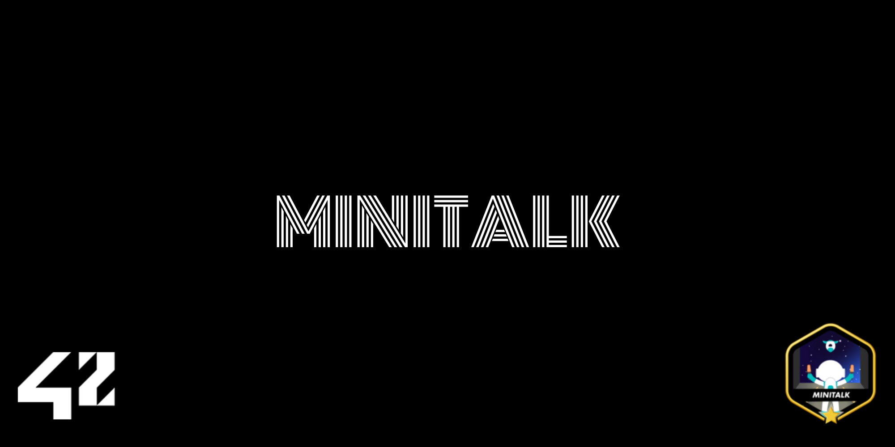

# Minitalk - UNIX Signal Communication



*This project has been created as part of the 42 curriculum by carpe.*

<p align="center">
  
</p>

<p align="center">
  
  
  
</p>

---

## 📋 Description

**Minitalk** is a 42 curriculum project that focuses on inter-process communication using UNIX signals. The project involves creating a client-server application where data is exchanged exclusively through signal handling mechanisms.

The goal is to build a communication system that allows a client to send text messages to a server, with the server receiving and displaying these messages. This project deepens your understanding of UNIX signals, signal handling, and real-time process communication.

### Project Goals

- **Master UNIX signals**: Learn how to use SIGUSR1 and SIGUSR2 for inter-process communication
- **Process communication**: Understand client-server architecture via signals
- **Signal handling**: Implement robust signal handlers with proper setup using `sigaction`
- **Timing management**: Deal with signal delivery and synchronization challenges
- **Best practices**: Follow the 42 Norm and write memory-leak-free, robust C code

---

## 🛠️ Instructions

### Compilation

To compile the project (both client and server):

```bash
make
```

### Available Make Rules

```bash
make              # Compile the client and server executables
make all          # Same as make
make clean        # Remove object files (.o) and dependencies
make fclean       # Remove object files and executables
make re           # Recompile everything (fclean + all)
make bonus        # Compile with bonus features (server acknowledgment + Unicode)
```

### Running the Program

#### 1. Start the server (in one terminal)

```bash
./server
```

The server will print its PID on startup:
```
Server PID: 12345
```

#### 2. Send a message from the client (in another terminal)

```bash
./client <SERVER_PID> "Your message here"
```

**Example:**
```bash
./client 12345 "Hello from Minitalk!"
```

The server will receive and display the message without delay.

#### 3. Multiple clients

The server can handle multiple clients sequentially:

```bash
# Terminal 1: Start server
./server

# Terminal 2: Client 1
./client 12345 "First message"

# Terminal 3: Client 2
./client 12345 "Second message"
```

---

## 📚 Project Overview

### Mandatory Part

**Client executable:**
- Takes two arguments: server PID and message string
- Sends the message to the server using UNIX signals
- Each character is encoded as a sequence of bits
- Uses SIGUSR1 and SIGUSR2 to represent bit values

**Server executable:**
- Displays its PID on startup
- Receives signals from clients
- Decodes the bit sequences into characters
- Displays received messages without delay
- Can handle multiple clients without restart

### Signal Usage

- **SIGUSR1**: Represents binary `1`
- **SIGUSR2**: Represents binary `0`

Each character is sent as 8 signals (one per bit), starting from the most significant bit (MSB).

### Bonus Features

✅ **Server acknowledgment**: Server sends back a confirmation signal to the client after receiving the complete message

✅ **Unicode support**: The application can handle and correctly display Unicode characters (multi-byte characters like accents, emojis, etc.)

---

## 🎯 Technical Specifications

### Compilation Requirements

- **Compiler**: `cc` (C compiler)
- **Flags**: `-Wall -Wextra -Werror` (mandatory)
- **Dependencies**: libft (included in project)
- **Library**: ft_printf (included in project)

### Code Standards

- **Global variables**: Maximum one per program (one for client, one for server) with proper justification
- **Memory leaks**: NOT tolerated - all allocated memory must be freed
- **Signal handling**: Must use `sigaction` for robust signal setup
- **No segmentation faults** or unexpected crashes
- **Adherence to 42 Norm**: Required for all source files

### Allowed Functions

- `write`, `ft_printf`, `signal`, `sigemptyset`, `sigaddset`, `sigaction`, `kill`, `getpid`, `malloc`, `free`, `pause`, `sleep`, `usleep`, `exit`

### Communication Constraints

- Communication **must exclusively use UNIX signals** (SIGUSR1 and SIGUSR2 only)
- Performance requirement: 100 characters should display within approximately 1 second
- Signal queueing: Signals of the same type are NOT queued by the Linux kernel when already pending

---

## 📖 Resources

### UNIX Signals Documentation
- [Signal Handling in C (Linux man pages)](https://man7.org/linux/man-pages/man7/signal.html) - Comprehensive signal reference
- [sigaction() manual](https://man7.org/linux/man-pages/man2/sigaction.2.html) - Robust signal handler setup
- [kill() system call](https://man7.org/linux/man-pages/man2/kill.2.html) - Sending signals to processes
- [getpid() system call](https://man7.org/linux/man-pages/man2/getpid.2.html) - Getting process ID

### Signal Handling Best Practices
- [Signal Safety](https://man7.org/linux/man-pages/man7/signal-safety.html) - Async-signal-safe functions
- [POSIX Signal Handling](https://pubs.opengroup.org/onlinepubs/9699919799/basedefs/signal.h.html) - POSIX standard signals
- [Real-time Programming Guide](https://www.gnu.org/software/libc/manual/html_node/Signal-Handling.html) - GNU C Library signal guide

### Bit Manipulation
- [Bitwise Operations in C](https://en.cppreference.com/w/c/language/operator_arithmetic#Bitwise_operators) - Binary operations reference
- [Bit Shifting Tutorial](https://www.tutorialspoint.com/cprogramming/c_bit_fields.htm) - Understanding bit shifts

### 42 School Resources
- [42 Norm](https://github.com/42School/42cursus/blob/main/docs/en.norm.pdf) - Official 42 coding standard
- [42 Intranet](https://intra.42.fr) - Official project guidelines

### How AI Was Used

AI was utilized for **documentation and README creation purposes only**:
- Structuring the README following 42 standards and best practices
- Organizing technical specifications and system requirements
- Providing clear compilation, installation, and execution instructions
- Creating comprehensive resource references

**AI was NOT used for**:
- Implementing signal handling logic
- Writing the client/server communication code
- Problem-solving for signal synchronization challenges

This aligns with 42's philosophy of building strong foundational knowledge through genuine intellectual effort and peer learning.

---

## 🔄 How It Works

### Signal-Based Communication Flow

```
1. Server starts → prints PID
2. Client receives PID and message
3. Client encodes message as bits
4. Client sends each bit using signals:
   - SIGUSR1 for bit 1
   - SIGUSR2 for bit 0
5. Server receives signal → decodes bit
6. After 8 bits → character is complete
7. Server prints character
8. Process repeats for each character
9. (Bonus) Server sends acknowledgment to client
```

### Example: Sending 'A' (ASCII 65 = 01000001 in binary)

```
Signal sequence: SIGUSR2, SIGUSR1, SIGUSR2, SIGUSR2, SIGUSR2, SIGUSR2, SIGUSR1, SIGUSR2
Binary:         0        1        0        0        0        0        1        0
Result:         01000001 = 65 = 'A'
```

---

## 📝 Project Structure

```
minitalk/
├── Makefile                # Build configuration
├── minitalk.h              # Main header file
├── client.c                # Client implementation
├── server.c                # Server implementation
├── libft/                  # Custom C library
│   ├── Makefile
│   ├── libft.h
│   └── ft_*.c              # Library functions
├── ft_printf/              # Printf implementation
│   ├── Makefile
│   ├── ft_printf.h
│   └── ft_*.c              # Printf functions
├── README.md               # This file
└── assets/                 # Project assets
    ├──                     # Project Badge
    └── cover.png           # Project cover image
```

---

## ✅ Testing

### Manual Testing

Test the basic functionality:

```bash
# Terminal 1
make
./server

# Terminal 2
./client <SERVER_PID> "Hello, World!"

# Terminal 3
./client <SERVER_PID> "Testing multiple clients"
```

### Performance Verification

Ensure the program meets performance requirements (100 chars/sec):

```bash
# Create a test message with many characters
./client <SERVER_PID> "Lorem ipsum dolor sit amet, consectetur adipiscing elit. Sed do eiusmod tempor incididunt ut labore et dolore magna aliqua."
```

The message should display on the server side without noticeable delay.

### Edge Cases to Test

- Single character messages
- Empty strings (if applicable)
- Special characters and symbols
- Very long messages
- Unicode characters (bonus)
- Multiple rapid client connections

---

## 📌 Important Notes

- The server and client must handle all signals properly using `sigaction()`
- Use `pause()` on the server to wait for signals
- Proper synchronization is crucial; signals can be lost if not handled correctly
- Always use `usleep()` between signal sends to allow the kernel to process them
- Global variables should be used sparingly and only when justified
- Peer evaluation is crucial - test with classmates' implementations

---

## 🎓 Learning Outcomes

Upon completion of this project, you should understand:

- How UNIX signals work at the system level
- The limitations of signal-based communication (queueing, timing)
- Bit-level data encoding and transmission
- Inter-process communication (IPC) concepts
- Real-time programming challenges
- Signal safety and async-signal-safe functions

---

*Last updated: May 2026*
